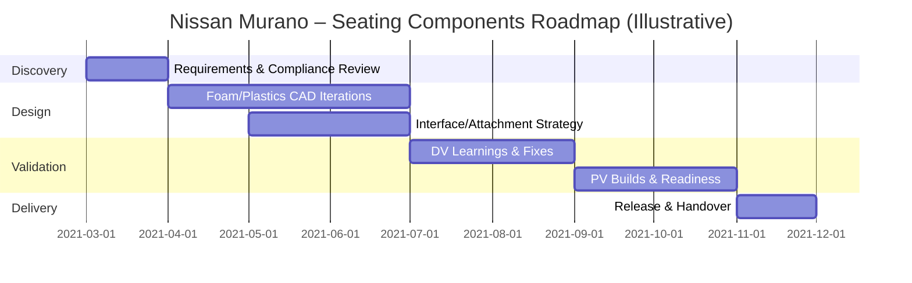

# Case Study: Nissan Murano — Plastics & Foam Seating Components (2021–2022)

## Context
Crossover platform demanding precise plastic/foam integration and faster delivery timelines under strict program compliance.

## Role
**Senior Design Engineer (Plastics + Foam)** — Cadmaxx Solutions, Pune, India.

## Responsibilities (Engineering + Product Management)
- Designed plastic and foam seating components using **UG NX**; applied OEM guidelines to **reduce prototyping rework by ~30%**.
- Created **B/C surfaces** and attachment features for side valance covers; improved design accuracy, **increasing first‑time approvals by ~20%**.
- **Led foam A/B surface development in cross‑functional teams**; ensured seamless integration and **cut delivery timelines by ~15%**.
- **Documented and managed product requirements & design changes** in **Teamcenter**; ensured **regulatory compliance** (ECE, FMVSS, Euro NCAP) and supported informed decisions across stakeholders.
- **Data‑driven decisions & acceptance**: contributed to **~15% increase in product acceptance** by tying feature choices to measurable performance criteria.
- **Agile practice**: actively supported **backlog management, sprint planning, MVP delivery**, and stakeholder demos.

## Tools & Methods
UG NX, Teamcenter, **Jira**, **Miro**, **Figma**, Trello, Microsoft Office; GD&T, DFMEA.

## Artifacts & Templates
- PRD & backlog templates: see `../02-Templates/PRD-Template.md`, `../02-Templates/Backlog-Template.md`
- Risk & review: `../02-Templates/Risk-Register-Template.md`, `../02-Templates/Design-Review-Checklist.md`
- Roadmap (illustrative Mermaid) below.

## Measurable Outcomes
- ~30% reduction in prototyping rework.
- ~20% increase in first‑pass approvals.
- ~15% faster delivery timelines.
- ~15% increase in product acceptance via data‑driven decision‑making.

## Mermaid Roadmap (Illustrative)

## Lessons
- Clear acceptance criteria + DoD across teams kept deliveries on time.
- Tying feature choices to measurable outcomes improved stakeholder alignment.

## (To be completed) Memorable Risk Solved
> Placeholder — to be filled with specific risk & mitigation you’ll provide.
